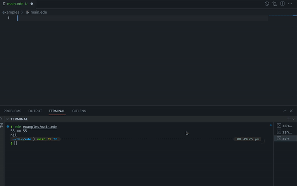

# Ede

Yet another scripting language.

Ede is designed to be easy to learn and use, with a simple, lightweight syntax and support for common programming constructs such as variables, loops, and conditionals. The name "ede" means "language" in Yoruba, a language spoken in West Africa.

The inspiration for writing Ede came from the book [Writing An Interpreter In Go](https://interpreterbook.com/). Ede employs a go-like syntax, albeit untyped, and also from other languages.



### Installation

To install ede, you will need to have Go installed on your system. You can then use the following command:

```bash
go get github.com/username/ede
```

### Getting Started

To get started with ede, create a new file with the extension .ede and start writing code! Here is a simple example that prints "Hello, World!" to the console:

```ede
println("Hello, World!")
```

You can then run your code using the following command:

```bash
ede filename.ede
```

### Syntax Highlighting

Ede supports syntax highlighting for vscode. To enable it, copy the folder `ede-vscode` to your vscode extensions folder.

## Tasks

- [ ] Set algebra
- [ ] Date type
- [ ] Modules
- [x] Syntax highlighting
